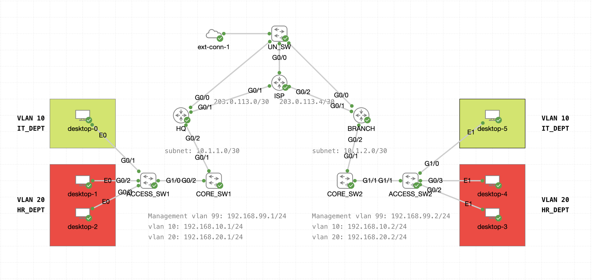

# Automated WAN Migration & Security Compliance

> **STATUS: IN PROGRESS**

## Project Overview
This repository contains a modular Python-based automation framework designed to streamline the migration of enterprise network infrastructure. The project focuses on transitioning from legacy, flat-network architectures to scalable, routed Wide Area Network (WAN) topologies.

By leveraging **Python** and **Netmiko**, this framework orchestrates the provisioning of OSPF-based routing underlays and secure, VLAN-based overlays across HQ and Branch office environments.

## Current Network Topology

## Core Objectives
* **WAN Scaling:** Automating the implementation of OSPF routing protocols across point-to-point `/30` transit links.
* **Service Provisioning:** Dynamically deploying VLANs, SVIs, and security policies.
* **Consistency:** Eliminating manual CLI errors through Infrastructure-as-Code (IaC) principles.
* **Modular Orchestration:** Utilizing a dependency-aware framework to ensure the "Underlay" (routing) is built before the "Overlay" (services).

## Project Roadmap
- [x] Initial design and topology definition.
- [x] Basic Netmiko connection framework development.
- [ ] OSPF Underlay automation logic.
- [ ] VLAN/SVI Overlay deployment.
- [ ] Security compliance and audit verification module.

## Technical Stack
* **Language:** Python
* **Automation Library:** Netmiko
* **Data Formatting:** YAML (for device inventory management)
* **Environment:** GNS3 / EVE-NG Simulation

---
*Developed as part of an advanced networking infrastructure study.*
