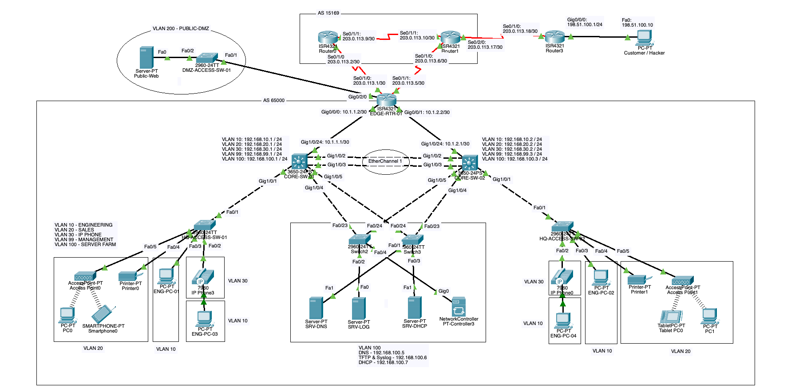
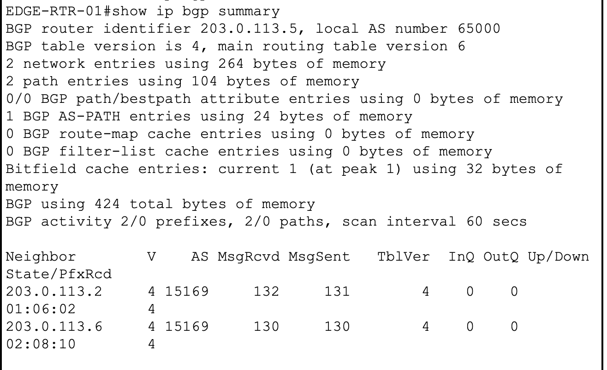
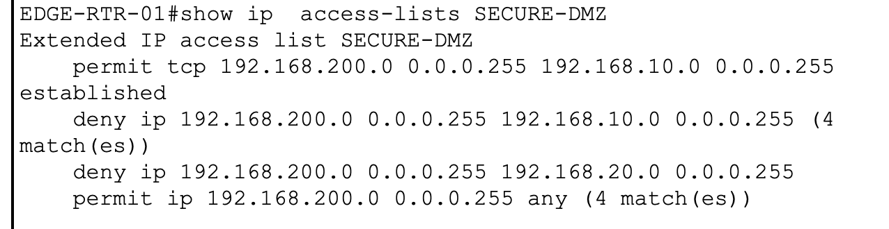

# Enterprise Edge Network Architecture with Multi-ISP Redundancy and Secured DMZ

## 📌 Project Overview
This repository contains a fully converged, high-availability enterprise campus network architecture designed and validated within Cisco Packet Tracer. The project focuses on bridging local routing domains with the global internet edge, implementing dual-homed BGP internet paths, automated link failover, and a strict zone-based security architecture to protect internal infrastructure.

## 🗺️ Network Topology Overview
Below is the architectural layout of the corporate campus network, featuring a redundant multilayer core, structured user access layers, an isolated server farm, and a public-facing Demilitarized Zone (DMZ).

---

## 🛠️ Technical Profile & Protocol Matrix

| Layer / Domain | Protocols & Technologies Implemented |
| :--- | :--- |
| **Layer 2 (Switching)** | VLAN Segmentation, Rapid Spanning Tree Protocol (RSTP), EtherChannel (LACP), Root Guard |
| **Layer 3 (Routing)** | Inter-VLAN Routing, Multi-Area OSPF (Area 0 Backbone), Default Route Injection |
| **Layer 4 Edge (BGP)** | External BGP (eBGP) dual-peering, Floating Static Routes (AD 10 Backup) |
| **Layer 7 Security** | Dynamic NAT (PAT Overload), Static NAT (Port Forwarding), Stateful-Mimicking Extended ACLs |
| **Observability** | NetFlow Version 9 Export Configuration |

---

## 🏗️ Core Design Frameworks

### 1. High Availability & Resiliency Asymmetry
The campus infrastructure implements tiered network resiliency based on asset criticality to maximize operational uptime while optimizing infrastructure deployment costs:
* **Core & Server Farm Infrastructure (VLAN 100):** Configured with full mesh dual-homed uplinks across redundant core multilayer switches (`CORE-SW-01` and `CORE-SW-02`) connected via an aggregate EtherChannel link to eliminate single points of failure (SPOF) for core enterprise assets.
* **User Access Layer (Switch 1 & Switch 4):** Utilizes single-uplink distribution paths. This represents a calculated engineering tradeoff, prioritizing infrastructure allocation toward critical database and application uptime.

### 2. Perimeter Security & DMZ Containment Policy
The public-facing Web Server lives in an isolated boundary segment (**VLAN 200 - PUBLIC-DMZ**). To protect internal employee floors (Engineering, Sales) from potential web asset compromise, a strict stateful-mimicking Extended Access Control List (`SECURE-DMZ`) is deployed on the edge gateway interface:
* **Inbound Access Control:** External public traffic is restricted strictly to HTTP (TCP Port 80) via targeted Static NAT port forwarding. Raw ICMP and unmapped protocols are dropped at the perimeter boundary.
* **Lateral Containment:** The DMZ server is categorically blocked from initiating communication into internal campus subnets.
* **Stateful Reply Logic:** Utilizing the `established` TCP flag matching keyword, the firewall policy allows the server to send return packets to internal management subnets *only* if the session was originally initiated by an internal network administrator.

---

## 📊 Verification & Validation Logs

### ☁️ Edge BGP Peering Verification
Running `show ip bgp summary` verifies stable, active peering with both upstream ISPs (`AS 15169`). The numerical value in the state column confirms the neighborhood state is **Established**.

### 🧱 Real-Time Security ACL Match Metrics
Running `show ip access-lists SECURE-DMZ` demonstrates the precision of the active containment policy. The tracking engine registers exact matches on drops when lateral movement is attempted, alongside permitted traffic for external system update patches.

### 🌐 Edge Translation Validation (Static NAT)
An external testing node (`Customer / Hacker PC`) successfully accesses the hidden internal DMZ web assets via the public IP address endpoint, validating the active port-forwarding state.

---

## 🚀 How to Run the Project
1. Clone this repository to your local machine.
2. Ensure you have **Cisco Packet Tracer** installed.
3. Open the file located in `/topology/Enterprise_Edge_Topology.pkt`.
4. Devices are fully pre-configured; use the end-user simulation nodes to trace real-time ICMP and HTTP traffic paths across the protocol boundaries.
